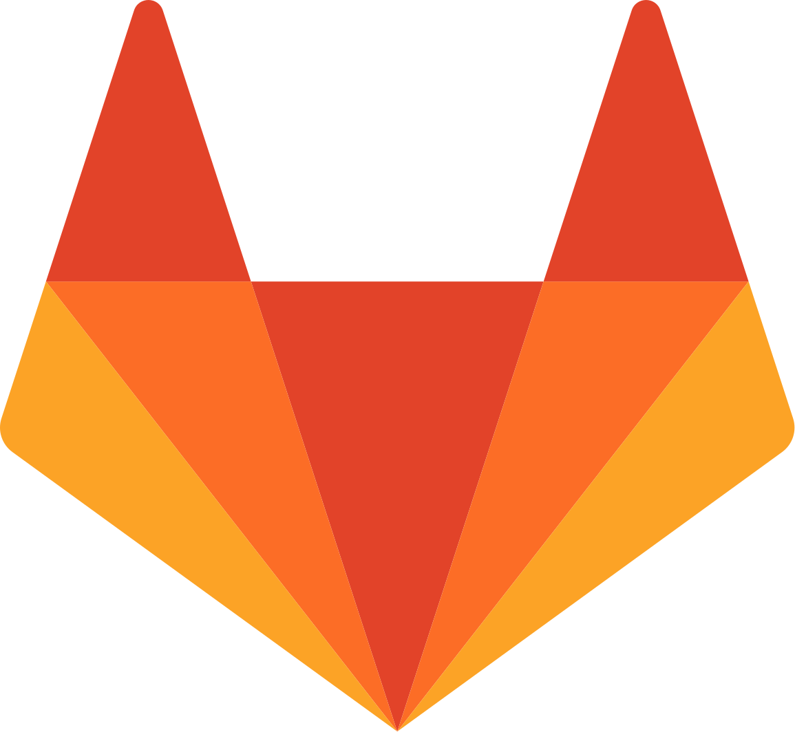
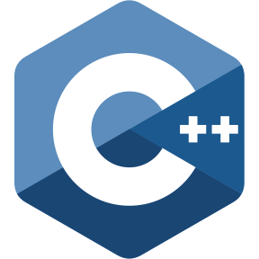
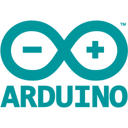
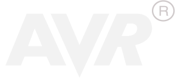
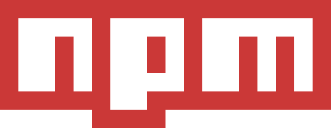
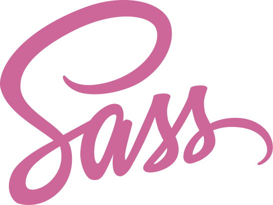
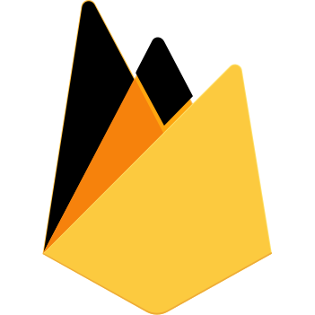
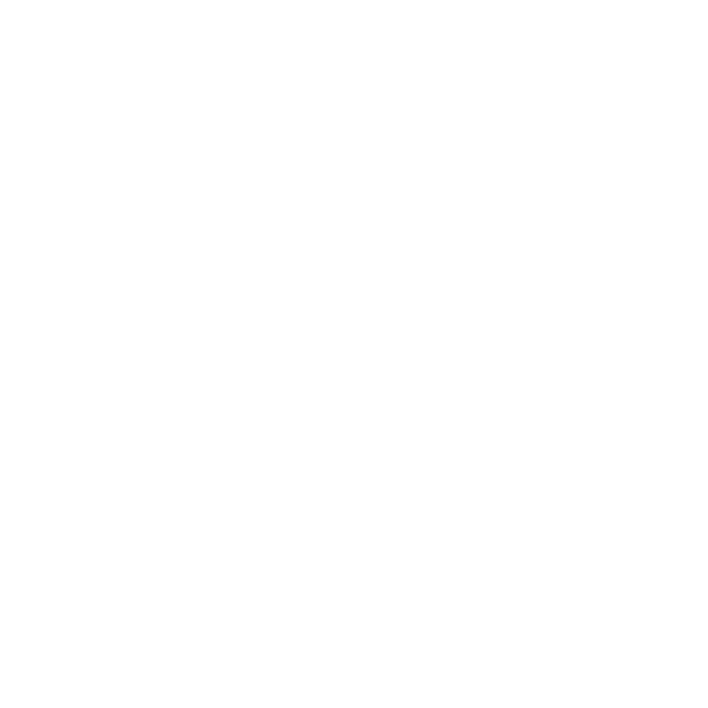
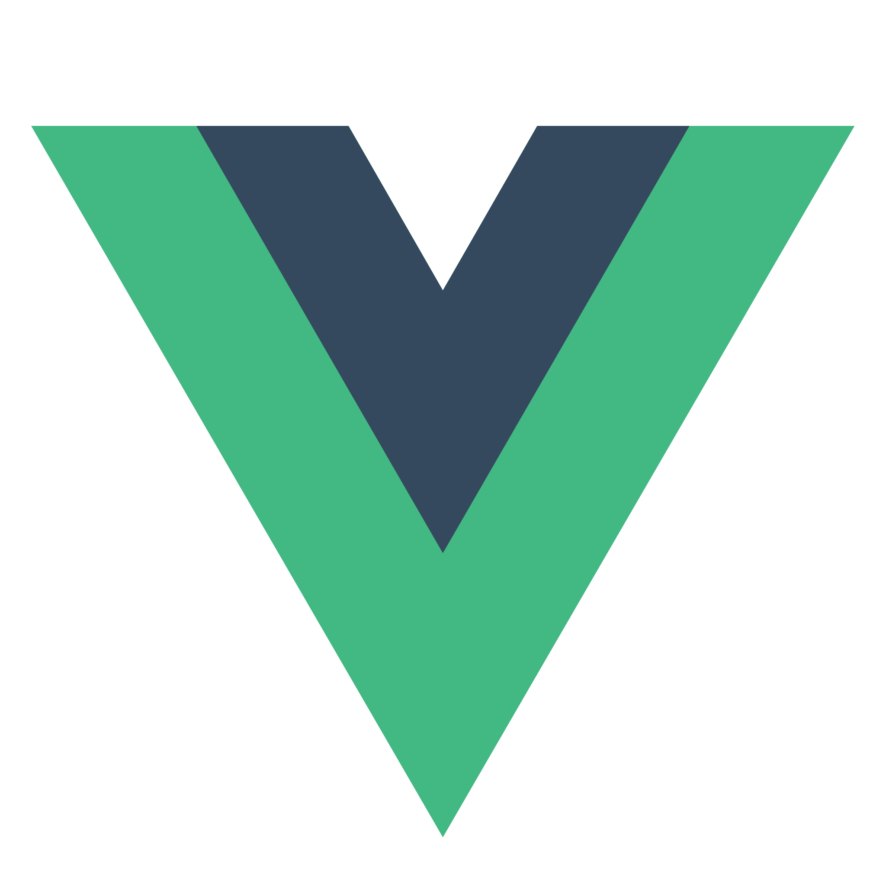

## Don't see any recent activity here? It's probably because I was out of the party making some private stuff at [ GitLab](https://gitlab.com/maddsua)

# Tools and languages

I'm not listing tools like Photoshop/Indesign/Premiere Pro or even Blender.

Including that tools, you would see a pretty long list. Nobody usually cares. If you do, feel free to ask.

Just cause lot of icons look cool 😎

## IoT, platform specific or backend

  
  
  
  
  
  
  
  
  

## Frontend, or rather Jamstack

  
  
  
  
  
  
  
  

---

Sorted by the level of experience (like hours in-game on Steam), where first place means that tool or language was extensively used by me for a long time, and last place does not means anything and my scale is just broken 😎
